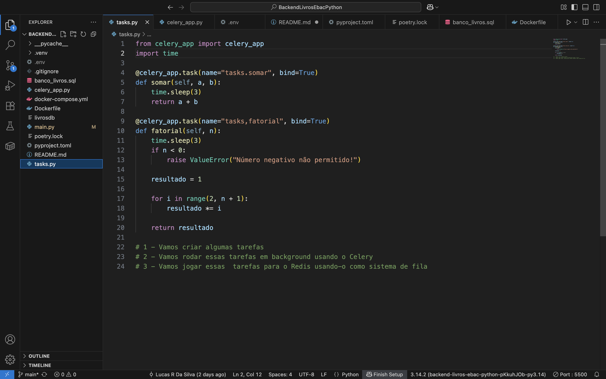
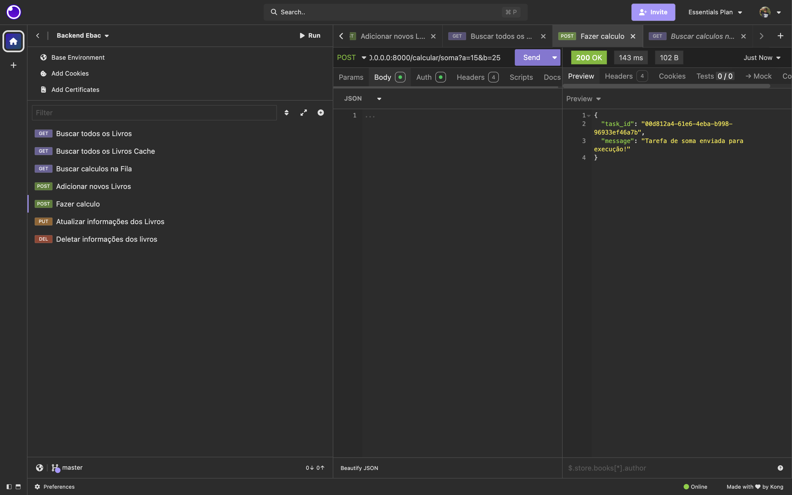
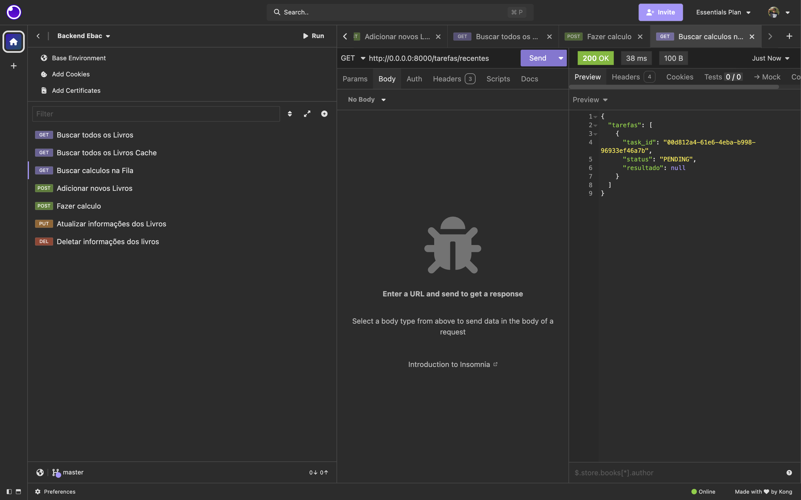
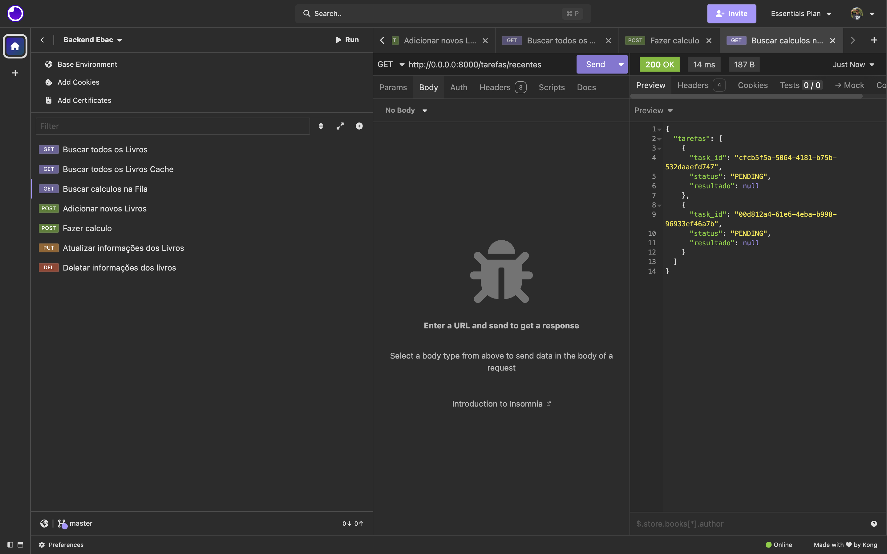

Tarefa de livros Python EBAC

Projeto: Filas de Mensagens e Processamento Assíncrono com Celery, Redis e FastAPI

Descrição

Este projeto tem como objetivo demonstrar a utilização de filas de mensagens para processamento assíncrono em aplicações Python utilizando Celery, Redis e FastAPI.

Estrutura do Projeto

celery_app.py: Configuração do Celery, definindo o Redis como broker e backend. As tarefas assíncronas são registradas neste arquivo.
tasks.py: Implementação das tarefas assíncronas calcular_soma e calcular_fatorial, ambas com simulação de workload usando time.sleep().
main.py: API construída com FastAPI, contendo dois endpoints para disparar tarefas de soma e fatorial sem bloqueio da aplicação principal.
Requisitos: celery, redis, fastapi, uvicorn
Passo a Passo

Instalação

Crie e ative um ambiente virtual.
Instale as dependências:
pip install celery redis fastapi uvicorn
Configuração do Celery

Em celery_app.py, configure Celery usando o Redis como broker e backend.
Tarefas Assíncronas

Em tasks.py, crie as funções:
calcular_soma(x, y) – retorna a soma de dois números após simular uma demora.
calcular_fatorial(n) – retorna o fatorial de um número, também simulando workload.
API FastAPI

Em main.py, implemente dois endpoints POST:
/calcular/soma: recebe dois números, dispara a task de soma.
/calcular/fatorial: recebe um número, dispara a task de fatorial.
Os endpoints retornam o task_id imediatamente.
Execução do Worker

Execute o worker do Celery para processar as tarefas em background:
celery -A celery_app worker -l info
Execução da API

uvicorn main:app --reload

Testando a API

Utilize um cliente HTTP (como Postman ou curl) para enviar requisições POST para os endpoints `/calcular/soma` e `/calcular/fatorial`. As tarefas são processadas em background pelo Celery e o retorno da API é imediato, com o `task_id` da tarefa.

Exempos das tasks sendo rodadas no Insomnia pelo Celery:

